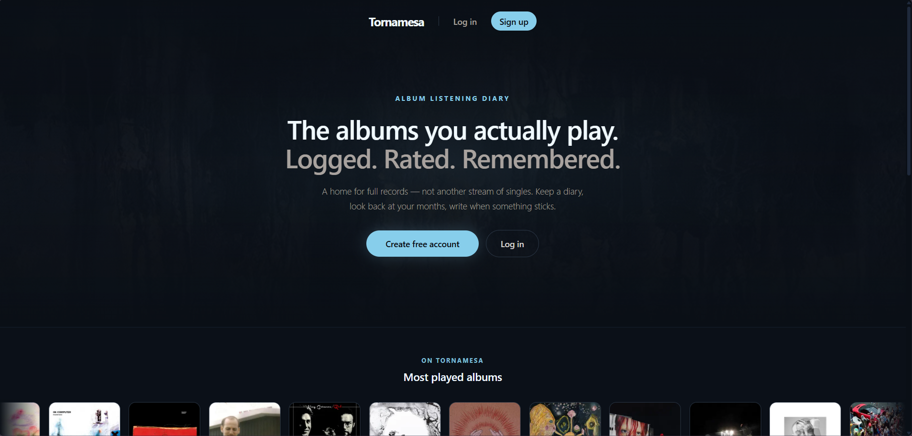
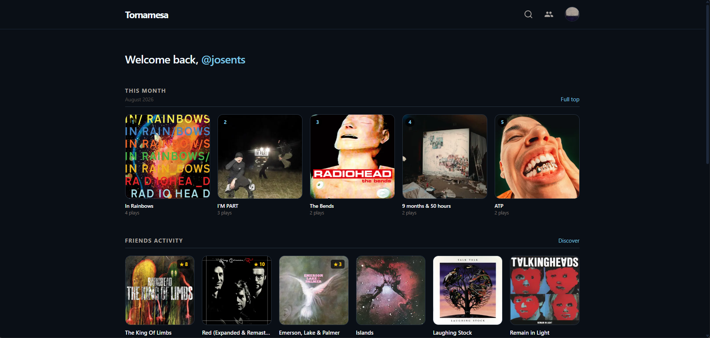
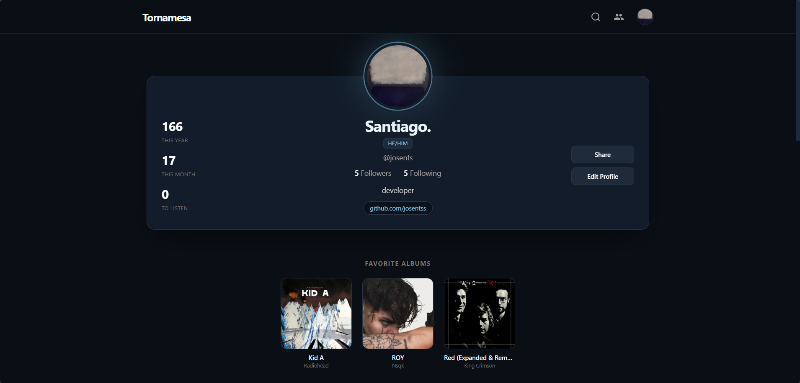
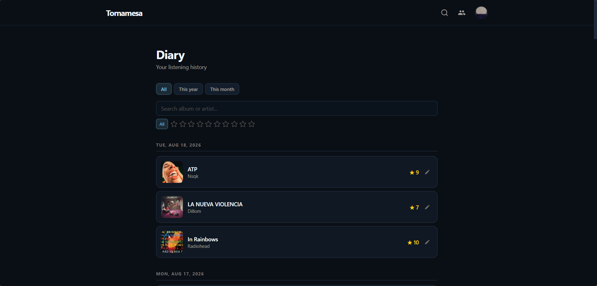
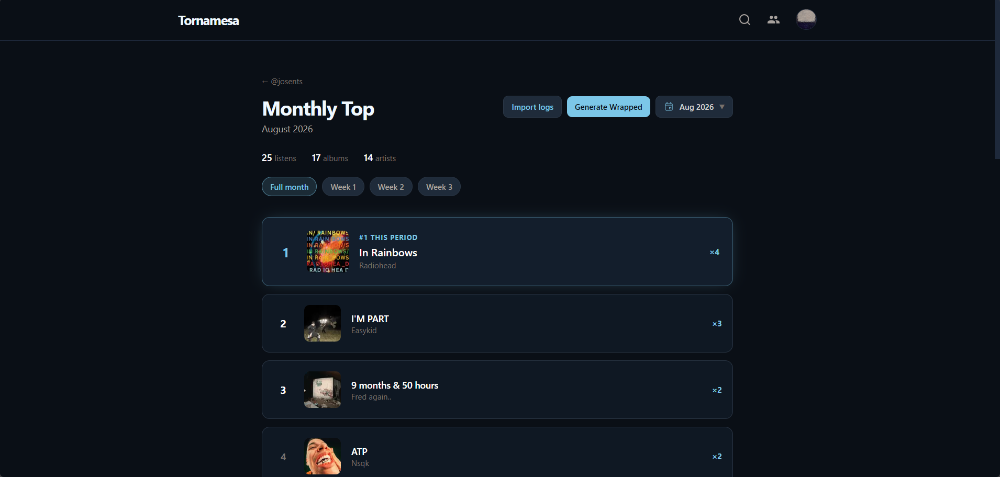
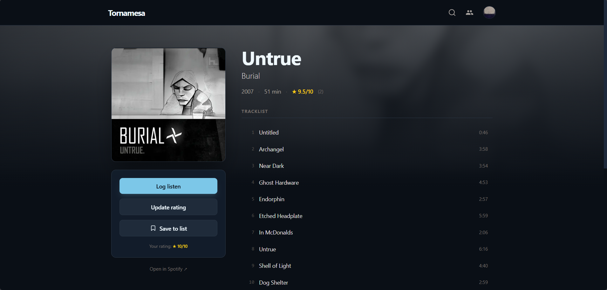

# Tornamesa

Tornamesa es una app para llevar un **diario de álbumes**: lo que escuchas, cómo lo puntúas y cómo se ve tu mes en música. Su principal ayuda es en el registro del álbum completo, ya que las plataformas de streaming registran escuchas por canciones detalladas del álbum y no por su estructura de principio a fin.

No reemplaza a Spotify ni a un reproductor. Es el lugar donde **registras el disco**, no la canción suelta, con esto construyes un historial que después puedes revisar, comparar y compartir.

**Ingresa:** [https://tornamesa-nu.vercel.app](https://tornamesa-nu.vercel.app)

> Versión estable temprana. Puede haber detalles por pulir; el feedback sería la mejor ayuda para que cada vez sea más robusta.

---

## Para quién es

Si alguna vez guardaste discos en notas del celular, en una hoja o en la cabeza (“este mes escuché mucho X álbum”), Tornamesa se hizo para eso, pero con perfiles, diary, tops y un poco de elementos sociales.

---

## Qué puedes hacer

- **Registrar escuchas** de un álbum (log)
- **Puntuar del 1 al 10** y, si quieres, dejar una reseña
- Ver tu **diary** (historial editable: fecha, rating, texto)
- Revisar el **monthly top** (y semanas) y generar un **resumen** para guardar o compartir
- Armar **listas** (incluida “To listen”)
- **Seguir** a otros usuarios, ver actividad reciente y descubrir perfiles por gustos parecidos
- Ajustar **privacidad**: perfil privado, diary público/privado, ocultar actividad
- **Importar** meses viejos desde notas en `.txt` con un formato específico

---

## Capturas

  

<em>Página principal</em>

  

<em>Dashboard con usuario iniciado</em>

  

<em>Perfil — stats, actividad, listas y tops</em>

  

<em>Diary — historial de escuchas</em>

  

<em>Monthly top — el mes en discos</em>

  

<em>Álbum — log, rating y reseñas</em>

---

## Cómo empezar

1. Ingresa en [tornamesa-nu.vercel.app](https://tornamesa-nu.vercel.app)  
2. Crea tu cuenta (personalizando tu perfil si es de tu gusto)
3. Busca un disco y registra la primera escucha  

No hace falta instalar nada ni levantar el proyecto en tu máquina: la app está pensada para usarse *online* y así poder manejar de mejor manera su punto social.

---

## Stack

Para quien mira el repo y tiene curiosidad técnica.

| Tech | Usado para |
|--------|-----|
| [Next.js](https://nextjs.org/) 14 | App web |
| [Supabase](https://supabase.com/) | Auth y base de datos |
| [Spotify Web API](https://developer.spotify.com/) | Metadatos de álbumes (portada, título, artista) |
| [Upstash](https://upstash.com/) Redis | Rate limiting |
| [Vercel](https://vercel.com/) | Hosting |

Tornamesa **no es** un cliente de Spotify ni reproduce música: solo consulta datos de catálogo.

---

## Info del repositorio

El código es público bajo MIT por transparencia y por si a alguien le sirve de referencia.

**No hay una guía para “correr local en usuarios finales”.**  
Montar una copia propia implica cuenta Supabase, claves de Spotify, variables en el host, etc. No he creado una guía completa para esto.
Dicho anteriormente, **Tornamesa** está pensada para su uso *online*, con ello tendría un mejor sentido social.

---

## Feedback

Si algo falla, se traba o se siente raro en el día a día, puedes abrir un **issue** en este repo o escribirme por **Discord**: *josents*

---

## Licencia

[MIT](./LICENSE) © 2026 [josentss](https://github.com/josentss)
